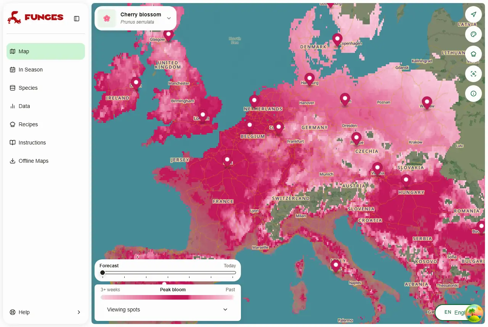
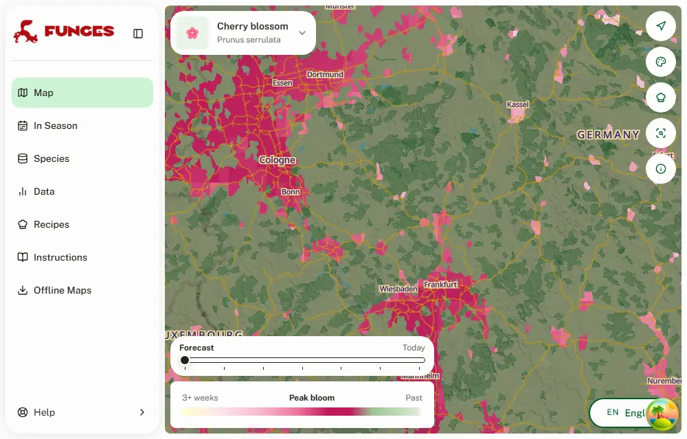
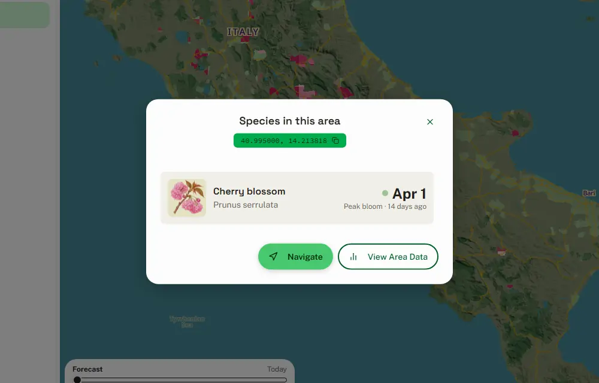
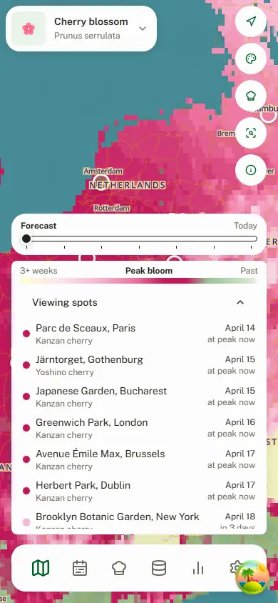
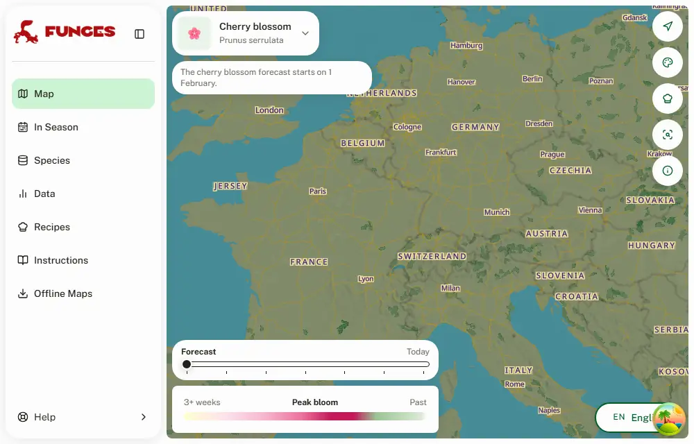

# Cherry blossom: a peak-bloom forecast

Date: 2026-09-30 (roadmap #272, step 5)

The first "spectacle" layer. It forecasts when the Japanese flowering cherries peak, not where something can be foraged. So it has its own model, driven by winter cold and spring warmth rather than rain. This record is its design and the evidence behind `backend/bloom.py`'s constants.

**The values below are agent-derived and wait on Loris's approval.** They come from public bloom records and NASA POWER temperatures; no phenologist has reviewed them. `backend/tools/calibrate_bloom.py` reproduces every number here.

## What it looks like

The map for 15 April 2026, from the dry run below (winter from normals), with tiles built by the real MapLayer tooling and served into the app locally:

Only built-up areas are drawn, where the trees are planted:

A click opens the same info modal as a species, with cherry blossom's peak date where a species has its score:

Off-season (today) the selector's notice says when the forecast starts:

## What it follows

- **The map: _Prunus serrulata_**, the Japanese flowering cherry (Sato-zakura cultivars, mostly 'Kanzan'). It is the ornamental cherry of European and US streets and parks.
  - iNaturalist has 42,963 observations of it, 12,891 of them from February–May 2024–26 with coordinates good to 1 km.
  - It has 1,698 of Yoshino (_P. × yedoensis_), 226 of them in those springs.
- **Not followed:**
  - wild cherry (_P. avium_) and orchards: another species, another season;
  - _P. sargentii_ parks.

## The model

A sequential chill-and-forcing model on the daily mean temperature, (Tmax + Tmin) / 2:

1. From 1 November, count the days with a mean below **17 °C** (`CHILL_BELOW`).
2. When the count reaches **120** (`CHILL_DAYS`), start adding each day's mean above **−3 °C** (`FORCE_BASE`).
3. The peak is the day the sum reaches the variety's requirement (`FORCING`):

| variety          | requirement | fitted on                                                     |
| ---------------- | ----------: | ------------------------------------------------------------- |
| Yoshino          | 285 °C·days | NPS peak bloom (70% of blossoms open), Tidal Basin, 1982–2026 |
| Kanzan (the map) | 485 °C·days | median iNaturalist date per 0.5° cell, 296 cells, 2024–26     |

Most of Europe and the US have 120 days below 17 °C by 1 March, so the forcing starts then. Where winters are warm it starts later, which delays the bloom. That is the known behaviour of the warm-winter margin: southern Japan's Yoshino blooms late for its warmth. Where the count never reaches 120 (south Florida, south Texas) there is no peak, and the map draws nothing. It does the same where the sum isn't reached by 30 June.

The requirements put Kanzan 200 °C·days after Yoshino: about two weeks in a DC April, which is the gap the Tidal Basin and Brooklyn Botanic Garden see.

## Temperatures: why NASA POWER

- **The fit is on NASA POWER** daily T2M (MERRA-2, 0.5° × 0.625°, free of restrictions), the same source as the normals the forecast uses after its 7-day window.
- **WeatherAPI, which production runs on**, compared with POWER at the 387 iNaturalist cells, 12 April – 31 May 2026. The comparison uses (Tmax + Tmin) / 2 and moves WeatherAPI to POWER's grid elevation at 6.5 °C/km:

| region | WeatherAPI − POWER |
| ------ | -----------------: |
| NE     |           −0.48 °C |
| SE     |           −0.57 °C |
| USE    |           −0.26 °C |
| USW    |           +0.06 °C |

- **WeatherAPI's daily average** (`Temperature (C)`) runs up to 0.24 °C colder than (Tmax + Tmin) / 2 against POWER. So the model uses the latter.
- **WeatherAPI follows the base points' elevation.** Its difference from POWER correlates −0.66 with the elevation gap. So the normals are moved to each cell's elevation before they are spliced in.
- **The DC station is warmer than both.**
  - Reagan National (GHCN USW00013743) reads 0.66 °C above POWER and 0.55 °C above WeatherAPI, April–September 2026.
  - A fit on the station, as first planned, would put WeatherAPI forecasts days late.
  - On POWER, the DC-station fit ran 17–21 days late at iNaturalist's Yoshino cells.
- **The remaining offset:** WeatherAPI's 0.3–0.6 °C below POWER in Europe and the eastern US would push a peak about a day later. It is left uncorrected: it was measured in April–May only, and needs checking against February–March 2027.

## Tests

| test                                                                                                                      | mean absolute error | without a peak |
| ------------------------------------------------------------------------------------------------------------------------- | ------------------: | -------------: |
| **DC** Tidal Basin, 45 years, leave one year out                                                                          |        **3.3 days** |              0 |
| **Japan**, JMA Yoshino first bloom, 2,803 location-years, fitted on the north half and tested on the south half, and back |        **5.8 days** |      26 (0.9%) |
| **iNaturalist** _P. serrulata_, 296 cells, fitted on the US and tested on Europe, and back                                |        **6.6 days** |              0 |

- **What the iNaturalist error means.** A cell's median observation date is a noisy stand-in for its peak: misidentified early cherries, and records before and after the bloom. As baselines on the same cells:
  - one fixed date per continent scores 8.6 (tested on Europe) and 10.7 days (tested on the US);
  - a latitude line scores 16.4 and 9.6 days.
- **The Japan misses** are the warmest southern stations in the warmest winters. The model says there was not enough winter there.

### Chill step or plain degree-days

The spec asked to keep a plain degree-day model from a fixed date if it proved as accurate. The best one (from 1 March, base −2 °C):

| test        | degree-days from 1 March | chill + forcing |
| ----------- | -----------------------: | --------------: |
| DC          |                 3.5 days |        3.3 days |
| iNaturalist |                 6.4 days |        6.6 days |
| Japan       |                 9.0 days |        5.8 days |

It is as good in DC and the iNaturalist cities. But it blooms the warm south of Japan 9 days early on average, the error the chill step exists to remove. From 1 February it was worse everywhere (DC 3.4, Japan 20.4, iNaturalist 9.5).

**The parameter search:**

- **The grid**, searched in stages: chill threshold 5–25 °C, 15–150 days, base −6 to 7 °C. The totals of the three errors are flat near the optimum: a dozen settings sit within 0.4 days.
- **Why 17 °C / 120 days / −3 °C:** it is best on DC and iNaturalist, the places this map serves. It costs Japan 1 day against the setting best there (21 °C / 140 days, 4.8 days).

## The forecast

- **Inputs** (`backend/bloom.py`, from each `*_MapLayer.py`):
  - the regional master's daily Tmax/Tmin since 1 November, including its 7 forecast days;
  - from there to 30 June, the 1991–2020 POWER monthly normals (`backend/generated/bloom_normals_{EU,US}.npz`, rebuilt by `backend/tools/build_bloom_normals.py`). They are interpolated to days, from the 4 nearest grid cells, and moved to the cell's elevation.
- **Resolution:** base points are averaged into 0.1° cells:

| region |  cells |
| ------ | -----: |
| NE     | 31,414 |
| SE     | 46,443 |
| USE    | 33,125 |
| USW    | 49,168 |

- Cells with the same peak day are dissolved into one feature, so a tileset holds 56–68 features.
- NE and SE share 60 cells, USE and USW 290; there both draw.
- **Season:** 1 February – 30 June. Outside it the step returns before downloading anything.
  - Every town with a peak stays in the tiles all season, green once its bloom is done. One that vanished after its peak read as a town without cherries.
  - From July the map hides the layer. A peak over 150 days old is last season's: the map paints it transparent and a click opens nothing, which keeps last season's file harmless until the first run on 1 February.
- **Where the trees grow:** a town is drawn only if a normal year, from the 1991–2020 normals alone, brings its bloom by 7 June (`LATEST_NORMAL_PEAK`). This year's weather still sets when, so a town doesn't come and go between years.
  - iNaturalist has 7 records of _P. serrulata_ north of 62° N, all planted: Umeå, Örnsköldsvik, Jyväskylä, Syvde, Reykjavík and one undated in Bodø. Of those, Umeå blooms latest in a normal year, on 2 June. Tromsø, which the first build drew, comes on 14 June and has none.
  - On the 15 April 2026 dry run it removes 128 of 16,502 town cells: Tromsø and Rovaniemi, the ski towns of the Alps and the Rockies (Zermatt, St. Moritz, Aspen, Vail), upland towns in Norway, and a few warm-winter cells on the southern edges of Houston and San Antonio, where a normal winter is too mild for the chill.
  - A town takes its 0.1° cell's average height, so a valley town in a high cell blooms late on the map. Innsbruck (574 m) is drawn as if at 1,600 m; Chamonix (1,035 m, in a cell averaging 2,056 m) and Bormio drop out.
- **Cost:** one extra download of the region's master; 7–12 s and under 500 MB traced for the model and the dissolve, measured on the dry run.
- **Tiles:** bloom.py runs its own tippecanoe, to zoom 10 at normal detail, giving 0.3–1.8 MB per region. The forecast's settings (z6, `-d9`, simplification 4) suit the species mesh and shave a town into a shard.

**A dry run on 15 April 2026** at well-known cherry places, each for its own variety, with normals standing in for the winter the master doesn't hold yet (it starts on 12 April 2026). It is a check of the model; the app has no list of places:

| place                              | variety | predicted peak |
| ---------------------------------- | ------- | -------------- |
| Third Street Park, Macon           | Yoshino | 18 March       |
| Japanese Tea Garden, San Francisco | Yoshino | 19 March       |
| Passeggiata del Giappone, Rome     | Yoshino | 20 March       |
| Parque Juan Carlos I, Madrid       | Yoshino | 24 March       |
| Public Square Park, Nashville      | Yoshino | 24 March       |
| Waterfront Park, Portland          | Yoshino | 26 March       |
| UW Quad, Seattle                   | Yoshino | 29 March       |
| Tidal Basin, Washington DC         | Yoshino | 31 March       |
| Bloesempark, Amsterdam             | Yoshino | 1 April        |
| Parc de Sceaux, Paris              | Kanzan  | 14 April       |
| Japanese Garden, Bucharest         | Kanzan  | 15 April       |
| Järntorget, Gothenburg             | Yoshino | 15 April       |
| Greenwich Park, London             | Kanzan  | 16 April       |
| Avenue Émile Max, Brussels         | Kanzan  | 17 April       |
| Herbert Park, Dublin               | Kanzan  | 17 April       |
| Altstadt, Bonn                     | Kanzan  | 18 April       |
| Brooklyn Botanic Garden, New York  | Kanzan  | 18 April       |
| Tóth Árpád Promenade, Budapest     | Kanzan  | 18 April       |
| Kirschenhain, Vienna               | Kanzan  | 18 April       |
| Branch Brook Park, Newark          | Kanzan  | 19 April       |
| TV Asahi Cherry Avenue, Berlin     | Kanzan  | 22 April       |
| Binnenalster, Hamburg              | Kanzan  | 23 April       |
| The Meadows, Edinburgh             | Kanzan  | 24 April       |
| Dejvice Campus, Prague             | Kanzan  | 24 April       |
| Sakura Park, Warsaw                | Kanzan  | 28 April       |
| Langelinie, Copenhagen             | Kanzan  | 1 May          |

Those are climatological dates, and they sit in each place's usual window. Two exceptions:

- **Brooklyn** is a week early: its Cherry Esplanade Kanzan usually peaks in late April.
- **Rome** looks about a week early: the EUR lake usually peaks in late March to early April.

The iNaturalist cells show the same drift by latitude:

- US cells at 40–50° N come out 7–8 days late;
- European cells at 50–55° N come out 4–7 days early.

A single requirement for all Sato-zakura cultivars can't do better. Spring 2027 is the first real test.

## The map

Cherry blossom looks and behaves like a species layer, with its own colour scale:

- **Picking it:** "Cherry blossom" is under a **Spectacles** filter in the species panel.
  - Its code, `cherry_blossom`, passes `isMapSpecies` and works in `?species=`.
  - It is not a catalog species: no page, no photo ID, no score.
  - Its picture, a 'Kanzan' sprig in the catalog's style, is `src/assets/species/cherry_blossom.webp`, made with Codex's image tool. The selector, the species panel and the info modal show it.
- **The layers** are added at runtime the first time it is picked, in the species fills' place in the stack and with their opacity (`AdvancedMap.tsx`). The style JSONs, and `species:check` and the style tests that hold them to species scores, are untouched.
  - Unlike the species, it is drawn on towns, where the trees are planted, not on wild habitat.
  - The cells are clipped to Natural Earth's 1:10m urban areas (public domain; `backend/generated/bloom_towns_{EU,US}.geojson` from `backend/tools/build_bloom_towns.py`), rounded off and cut to land. Europe has 3,956 of them, the US 1,167, about 3% of the land.
  - A first version covered every land cell, which painted the whole continent.
- **The colour** is days to peak on the slider's day (`src/lib/bloom.ts`):
  - light yellow more than three weeks out, where the score layers start too;
  - pink deepening to the peak;
  - deep pink at peak ±2 days;
  - leaf green as the petals drop;
  - then, from two weeks after the peak, a steady pale green until 30 June.
- **The legend** is the score legend's card, with this scale and "3+ weeks · Peak bloom · Past".
- **A click** opens the same info modal as a species. Its one row reads "Cherry blossom, _Prunus serrulata_", then a swatch, the peak date and "Peak bloom · in 3 days" where a species has its score. A finished town opens it too ("Peak bloom · 14 days ago").
- **Off-season** (July–January) the selector's notice, the one that says a species isn't forecast here, says the forecast starts on 1 February.

## Places looked at

The dry run's places were checked for their variety against public sources (park pages, city inventories, OpenStreetMap):

- Yoshino at the Tidal Basin, Macon, Seattle, Portland, Nashville, San Francisco, Amsterdam's Bloesempark, Rome's EUR, Madrid and Gothenburg;
- Kanzan elsewhere.

Stockholm's Kungsträdgården and Copenhagen's Bispebjerg avenue are 'Accolade', a _P. sargentii_ hybrid, not a Japanese cherry this model follows.

## Rechecks, spring 2027

- The WeatherAPI–POWER offset in February–March, at the iNaturalist cells.
- The Kanzan requirement against 2027 iNaturalist records, and the latitude drift above.
- The Tidal Basin 2027 peak against the Yoshino forecast.
- The 7 June cutoff against 2027 iNaturalist records of planted trees in the north.

## Sources

- **NPS Tidal Basin peak bloom dates and JMA Yoshino first-bloom dates:** the GMU cherry blossom prediction competition's cleaned data, <https://github.com/GMU-CherryBlossomCompetition/peak-bloom-prediction>. Used for fitting only; not shipped.
- **NASA POWER** daily and climatology API, <https://power.larc.nasa.gov/>: MERRA-2 T2M, 1981–2026 daily, 1991–2020 monthly.
- **iNaturalist** API, taxon 125742 (_P. serrulata_) and 47352 (_P. × yedoensis_). Records with coordinates, not obscured, accuracy ≤ 1 km; for the cutoff, every record north of 62° N, planted ones included.
- **NOAA GHCN-Daily**, USW00013743 (Reagan National): only for the station comparison above.
