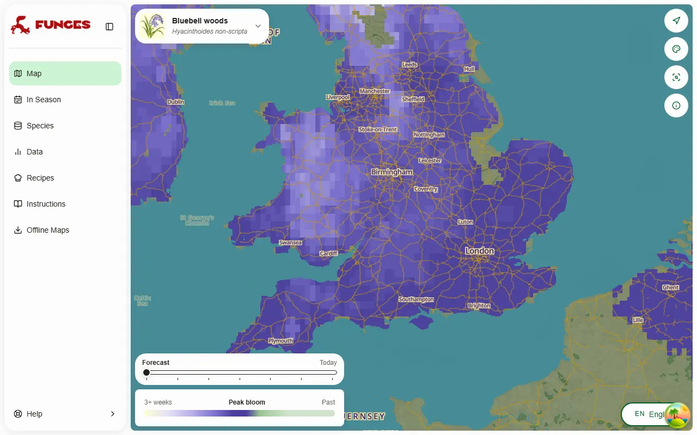
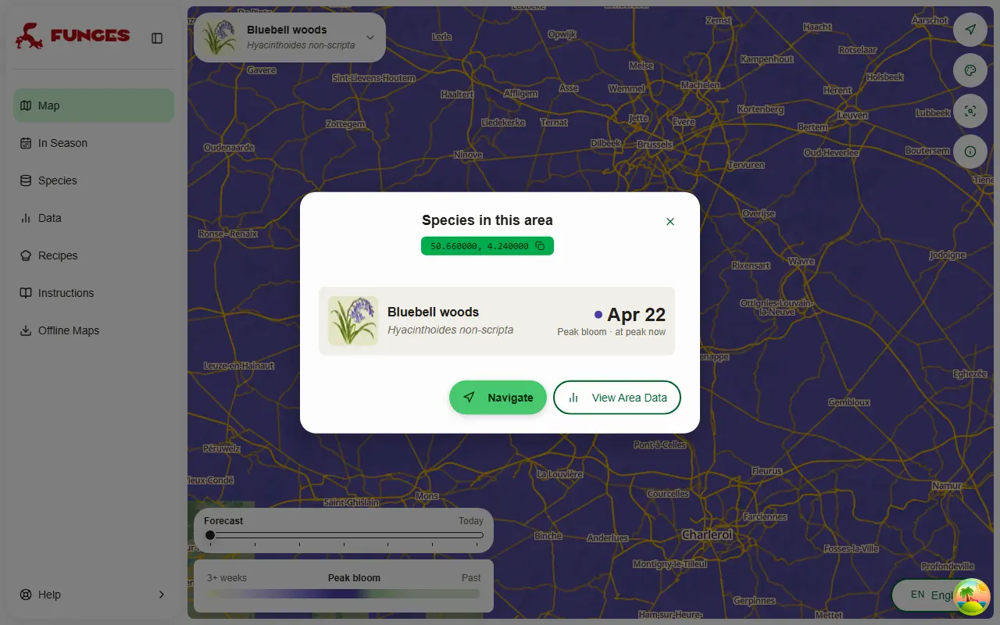
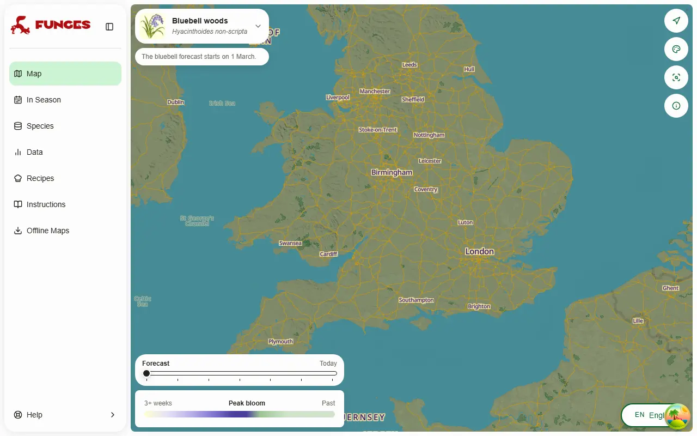

# Bluebell woods: a peak-bloom forecast

Date: 2026-10-10 (roadmap #272, step 5)

The second "spectacle" layer, after [cherry blossom](2026-09-30-cherry-blossom.md). It forecasts when the native bluebell (_Hyacinthoides non-scripta_) carpets its woods. This record is its design and the evidence behind `backend/bluebell.py`'s constants.

**The values below are agent-derived and wait on Loris's approval.** They come from iNaturalist records, one wood's warden reports and NASA POWER temperatures; no botanist has reviewed them. `backend/tools/calibrate_bluebell.py` reproduces every table (`--grid` for the parameter search).

## What it looks like

20–24 April 2026 in a dry run on the real NE master (observed from 12 April, normals before), with tiles from the production tooling served into the app locally. The south-east is at its peak, Wales and the north still to come:

A click lists the bluebell with its peak date, as cherry blossom does:

Off-season the selector's notice says when it starts:

## The model

Plain degree-days: from **1 April** (`START`, index 151 of a season from 1 November), each day adds its mean (Tmax + Tmin) / 2 above **2 °C** (`BASE`). The peak is the day the sum reaches **169 °C·days** (`FORCING`). Where it is not reached by 30 June there is no peak.

- **169 targets the median iNaturalist record date.** Full flower ("at its best") is about 12 °C·days, 1.5 days, earlier: on the same 60 cells of 2026, plain records give 162 and flowering-annotated ones 150. At 157 Hallerbos goes from 3.80 to 2.47 days off. 169 stays, because every test was fitted on it, as for cherry.
- **No chill step.** The best chill setting (90 days below 10 °C, then base 2 °C) totals 22.07 days of error against 14.17. It is worse on every test, and it leaves 10 cell-years without a peak.

## Data

- **iNaturalist, taxon 56132 only.** The Spanish bluebell (57635) and the hybrid (863646) are left out and checked per record. Europe, research grade, March–June 2016–2026, not obscured, accuracy ≤ 1 km or unknown: 12,217 records.
- **Plain records, not flowering-annotated ones.** The annotation is too thin to test on: 2,916 records, 2,090 of them from 2026. So the tests use March–June records, minus 65 annotated as budding, fruiting or without flowers. On 70 cells of 2026 their median runs 1.1 days after the flowering median.
- **Cells:** POWER cells (0.5° × 0.625°) with ≥ 8 records. 24 cells that are mostly sea are dropped (Skomer, Anglesey and other cliff tops, which flower late). That leaves **344 cell-years in 92 cells**: Great Britain 248; Ireland plus France, Belgium, the Netherlands and Germany 79.
- **Temperatures:** NASA POWER daily T2M, moved to the sightings' median elevation at 6.5 °C/km, as production moves the normals to a cell's elevation.
- **Hallerbos**, an independent series: the warden's near-daily reports at hallerbos.be give 15 springs (2010–2019, 2022–2026), taking the first report that calls the wood "op zijn mooist" (at its best). Dates and quotes are in the script's `HALLERBOS`.

## Tests

Mean absolute error in days:

| test                                                   |             model | one fixed date | latitude line |
| ------------------------------------------------------ | ----------------: | -------------: | ------------: |
| leave one year out, 344 cell-years                     |          **6.36** |           7.00 |          6.86 |
| fitted on Great Britain, tested on Ireland + continent |           **7.3** |            9.6 |           7.1 |
| fitted on Ireland + continent, tested on Great Britain |           **6.1** |            8.7 |           5.4 |
| Hallerbos, leave one year out on its own requirement   | **1.40** (r 0.94) |           4.73 |             – |
| Hallerbos with the iNaturalist requirement             |  3.80 (bias +3.8) |              – |             – |

- On cells with other years, the model scores 5.91 against 6.02 for each cell's own median in its other years; on cells with ≥ 15 records, 4.97 against 5.53 (fixed date) and 5.26 (latitude line).
- Year to year within cells, r = 0.45. The iNaturalist medians barely move between years, so the year-to-year evidence rests mainly on Hallerbos.
- **The grid (138 settings)** is flat on iNaturalist: leave-one-year-out stays within 6.02–6.36 for every start from 15 February to 1 April at bases −6 to +2 °C. Hallerbos is sharp: 1.40 at 1 April / 2 °C, at least 2.9 for any 1 March setting. Starting on 16 April collapses (year-to-year r falls from 0.46 to 0.18).
- **The runner-up** (1 March, −2 °C, 544 °C·days) is slightly better on iNaturalist (6.21, and it gets the spread between places right) but clearly worse at Hallerbos (3.27, r 0.68). After a warm March and a cool April (2012, 2017) it was 6–9 days early; the 1 April model was exact.
- **Robustness:** April–May records only, no elevation adjustment, sea cells kept, or strict accuracy all pick the same model, with the requirement at 165–174.

## The forecast

- **Inputs** (`backend/bluebell.py`, run by `bloom.build_spectacles` from the NE and SE MapLayer scripts):
  - the master's daily Tmax/Tmin since 1 November, including its 7 forecast days;
  - from there to 30 June, the POWER normals (`bloom_normals_EU.npz`), moved to each 0.1° cell's elevation.
- **Season:** built and shown 1 March – 30 June. Until about 25 March the map is just the normal year; the first peaks come in mid-April and nearly all are done by 31 May.
- **WeatherAPI runs 0.5 °C below POWER** in the forcing window, which puts peaks about 1.7 days late. It is left uncorrected, as for cherry; correcting it means lowering the requirement by about 12.

## The map

Cells are drawn on bluebell ground (`backend/generated/bluebell_ground_EU.geojson`, built by `backend/tools/build_spectacle_ground.py`):

- **Range:** the bluebell's share of plant records within 50 km is at least 0.1 of its typical share (GBIF 1990–2025, the `build_range_priors.py` machinery). It keeps 96.8% of sightings and 98.7% of those in the native countries, but only 8.6% of the 268 elsewhere. It drops Denmark, Germany, Switzerland and Italy. The app's own range prior (≥ 0.5) is too loose: it keeps 55% of the non-native sightings.
- **Habitat:** broadleaf trees (fagus + quercus + other_broadleaf) cover at least 3% of the 0.05° host-cover cell. Only the sum works, since the UK map puts nearly everything in `other_broadleaf`. The grid is smoothed over 5 km, so this is a light filter, not a woodland map.
- **Not Norway:** the range draws 78 cells around Stavanger; they are cut by country.
- **Not CORINE woods:** clipping to CORINE broadleaf and mixed forest (311, 313) keeps only 12% of the sightings (29% within 1 km), because most British bluebell woods are under its 25 ha minimum.
- **A normal year must peak by 31 May** (`LATEST_NORMAL_PEAK`): it hides 1% of the NE cells, all above 600 m.

The ground keeps 95% of the in-range sightings and all nine woods below. NE's base points cover 89% of it; the rest is open farmland without base points.

## Places looked at

| wood                | normal year | 2026 dry run | published window                               |
| ------------------- | ----------: | -----------: | ---------------------------------------------- |
| Ashridge            |      28 Apr |       28 Apr | best last week of April / first of May (NT)    |
| Kew                 |      24 Apr |       23 Apr | mid-April to May (Kew)                         |
| Wakehurst           |      26 Apr |       25 Apr | late April – early May (Kew)                   |
| Blickling           |      28 Apr |       27 Apr | end April / early May ± a week (NT)            |
| Rannerdale, Cumbria |       5 May |        7 May | mid-May usually best (open fellside)           |
| Hallerbos           |      24 Apr |       23 Apr | warden's median 20 Apr (14 Apr – 1 May)        |
| Zoniënwoud          |      24 Apr |       23 Apr | April–May (Natuurpunt)                         |
| Kluisbos            |      24 Apr |       23 Apr | mid-April – early May (Visit Vlaamse Ardennen) |
| Buggenhoutbos       |      23 Apr |       22 Apr | April–May (Natuurpunt)                         |

## Caveats

- **The regional pattern is the main error,** the same for every start and base: Belgium +5.2 days and France +4.6 (late); Scotland −8.6, Spain −8.4, Ireland −3.8 (early). A requirement rising with latitude doesn't remove it; it looks like oceanic against continental springs, which a daily mean can't see. Regional requirements would rest on 14–19 cell-years each, so they wait for 2027.
- **The early edge:** nothing can peak before about mid-April, so France's early woods in a warm spring (2026's annotated median: 3 April) come out up to 10–12 days late.
- **Cold, sunny Aprils run late:** 2021 by 9.5 days.
- **Elevation:** a cell's mean is used, so a valley wood in a hilly cell comes out late and a hilltop wood early, about a day per 50 m.

## Rechecks, spring 2027

- The 2027 iNaturalist medians and the Hallerbos warden's peak against the forecast, especially France's early cells and Scotland.
- Whether the flowering annotation keeps growing; a multi-year annotated set would replace the plain-record proxy.
- WeatherAPI against POWER in April at the bluebell cells.

## Sources

1. National Trust, Bluebells at Ashridge Estate: <https://www.nationaltrust.org.uk/visit/essex-bedfordshire-hertfordshire/ashridge-estate/bluebells-at-ashridge-estate>
2. Kew, Bluebell: <https://www.kew.org/plants/bluebell>; Spring at Kew: <https://www.kew.org/read-and-watch/things-to-do-spring-kew-gardens>
3. Kew, Bethlehem Wood (Wakehurst): <https://www.kew.org/wakehurst/whats-at-wakehurst/bethlehem-wood>
4. National Trust, Bluebells at Blickling Estate: <https://www.nationaltrust.org.uk/visit/norfolk/blickling-estate/bluebells-at-blickling-estate>
5. National Trust, Buttermere to Rannerdale walk: <https://www.nationaltrust.org.uk/visit/lake-district/buttermere-valley/buttermere-to-rannerdale-walk>
6. Hallerbos, Bloei hyacinten (yearly reports 2010–2026): <https://www.hallerbos.be/wanneer-bloeien-hyacinten/>
7. Natuurpunt, Boshyacint of wilde hyacint: <https://www.natuurpunt.be/soorten/planten-mossen-korstmossen/boshyacint-of-wilde-hyacint>
8. Visit Vlaamse Ardennen, 5x boshyacinten spotten: <https://www.visitvlaamseardennen.be/5x-boshyacinten-spotten>
9. Woodland Trust, When do bluebells flower in the UK?: <https://www.woodlandtrust.org.uk/blog/2026/02/when-do-bluebells-flower/>
10. POWO (Kew), _Hyacinthoides non-scripta_ (native range): <https://powo.science.kew.org/taxon/urn:lsid:ipni.org:names:971733-1>
11. Data: iNaturalist API v1 (taxon 56132); NASA POWER daily point API and 1991–2020 climatology; GBIF occurrence density tiles (taxon 5304283, Plantae 6); Open-Meteo elevation (Copernicus GLO-90); Natural Earth 1:50m map units and 1:10m land (pinned commit); the app's `EU_host_cover.npz`.
