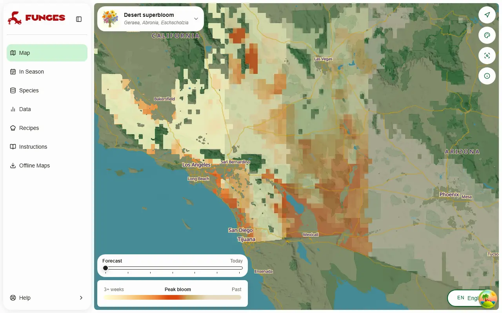
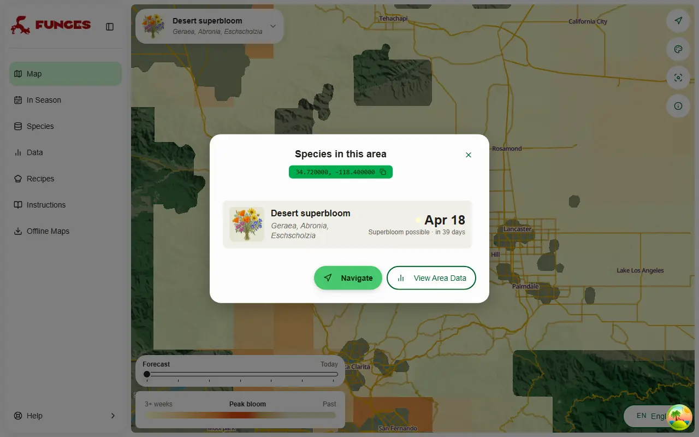
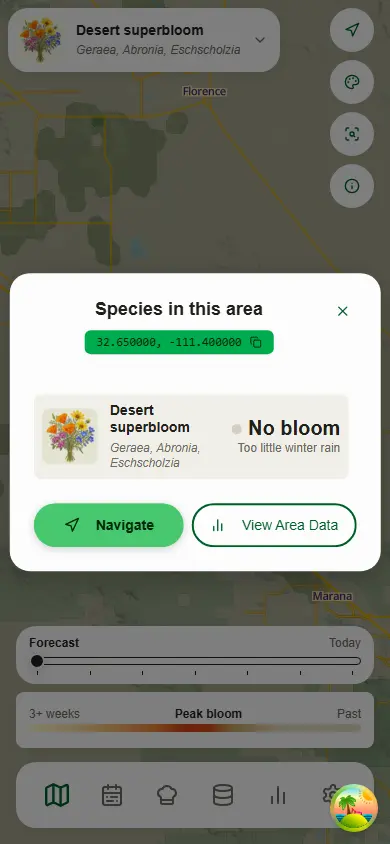
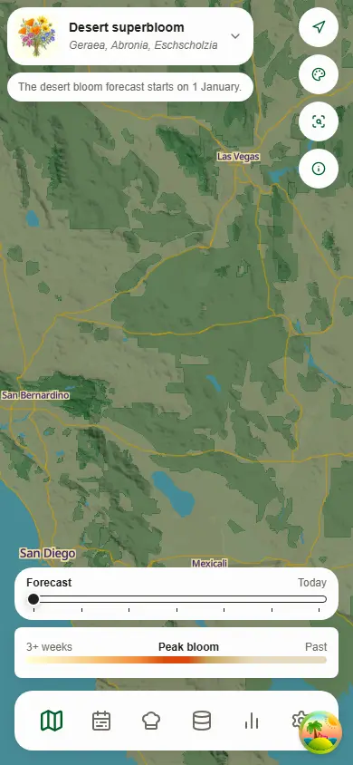

# Desert superbloom: a strength-and-peak forecast

Date: 2026-10-10 (roadmap #272, step 5)

The third "spectacle" layer, after [cherry blossom](2026-09-30-cherry-blossom.md) and [bluebell woods](2026-10-10-bluebell.md). It forecasts how strong the spring bloom of the south-western deserts will be, and when it peaks. This record is its design and the evidence behind `backend/superbloom.py`'s constants.

**The values below are agent-derived and wait on Loris's approval.** They come from iNaturalist records, park and press bloom reports, NASA POWER and ERA5 weather; no botanist has reviewed them. `backend/tools/calibrate_superbloom.py` reproduces every table (`--grid` for the parameter grids, `--master URL` for the rain-glitch scan).

## What it looks like

A dry run on the real USW master for 10 March 2027, served into the app locally. **For this picture only the levels are set by longitude** (superbloom in the west, then good, ordinary and no bloom), so all four show: on 10 October nearly every day of the season is still a normal.

A click gives the strength and the peak:

A winter too dry for a bloom, and the off-season notice:

 

## The model

**Strength** is the season's rain from 1 October to 31 March as a share of its 1991–2020 normal (`LEVELS`):

| share of normal | level | shown as             |
| --------------: | ----- | -------------------- |
|       under 60% | 0     | No bloom (grey sand) |
|         60–100% | 1     | Ordinary bloom       |
|        100–150% | 2     | Good bloom           |
|     150% and up | 3     | Superbloom possible  |

A day not yet measured counts as its normal, so early in the season the share leans towards 100%.

**The peak** is the day degree-days of the daily mean above **0 °C** reach **840** (`FORCING`), counted from **15 January** at the earliest and not before the season's rain reaches **40%** of its normal (`START_SHARE`).

**The literature's conditions did not hold up** once the share is known: a germinating storm (25 mm in 3 days by 31 December), frost and early heat add nothing (partial ρ −0.06, +0.07, −0.17), and every one of 148 storm-gate settings is at or below no gate. Weighting autumn rain, the previous season's or summer's did nothing either.

## Data

- **iNaturalist:** 77,596 research-grade records of 14 taxa, February–May 2014–2026, 31–37.5° N, 120.5–109° W. Effort is every vascular-plant record (v1 grid endpoint). All records count, not only flowering-annotated ones: the annotation lags (16% in 2025), which would read 2025–26 as failures.
- **Taxa:** each taxon's year signal against the others' within cells. The seven desert annuals (_Geraea canescens_, _Abronia villosa_, _Oenothera deltoides_, _Lupinus arizonicus_, _Malacothrix glabrata_, _Phacelia campanularia_, _Eschscholzia glyptosperma_) are kept (ρ 0.40–0.66), _Chylismia claviformis_ (0.71) and _Lupinus sparsiflorus_ (0.60) added, _Layia_, _Monolopia_, _Amsinckia_ and _Eriophyllum_ dropped (under 0.4). The California poppy counts on bloom ground (0.51; ssp. _mexicana_ 0.80, Picacho's poppy).
- **Cells:** POWER's own grid; 781 cell-years in 87 cells, 509 with ≥ 10 records for a peak date.
- **Bloom reports:** 68 documented place-years, 2016–2026, at seven places (NPS, California State Parks, Tom Chester's Anza-Borrego pages, the Theodore Payne hotline, the press).

## Tests

**Strength**, leave one year out:

| predictor                       | ρ share (pooled) | ρ within-cell | AUC superbloom vs poor years |        κ |
| ------------------------------- | ---------------: | ------------: | ---------------------------: | -------: |
| plain October–March total       |             0.22 |          0.46 |                         0.88 |     0.55 |
| **share of normal (the model)** |         **0.49** |      **0.56** |                     **0.99** | **0.60** |
| storm gate + frost + heat       |             0.41 |          0.53 |                         0.94 |     0.60 |

- 91% of the cell-years of 2017, 2019 and 2023 come out good or better (59% superbloom); 99.5% of 2018, 2021 and 2022 ordinary or less (74% none). 2020 is the false alarm: 151% of normal, a normal year in the reports.
- **The thresholds sit between two answers:** iNaturalist favours 0.45 / 0.55 / 1.2, the reports about 0.8 / 1.0 / 1.75 (a report calls a 50–80% year poor, while iNaturalist's signal only collapses below about 45%). 0.6 / 1.0 / 1.5 scores κ 0.52 against iNaturalist and 0.64 against the reports.
- **During the season** (normals after the issue date): within-cell ρ 0.41 on 1 January, 0.49 on 1 February, 0.54 on 15 February; off by ≥ 2 levels 5.6%, 1.5% and 0%.

**Timing**, mean absolute error in days, leave one year out:

| rows                             |    model | one fixed date | date per elevation band | lat/elevation line | the cell's own median |
| -------------------------------- | -------: | -------------: | ----------------------: | -----------------: | --------------------: |
| drawn cells, all records         | **11.5** |           15.8 |                    15.5 |               14.7 |                  12.7 |
| drawn cells, flowering-annotated | **12.6** |           15.5 |                    16.1 |               16.6 |                  15.3 |

- The rain gate takes 0.4–0.8 days off. Starting on 15 January rather than 1 February cuts superbloom years to 9.9 days. A 1 March start at 9 °C scores 11.2 but can't make February peaks, which Anza-Borrego and Picacho had in 2026 and Death Valley in 2016.
- The observed peak is noisy: a cell-year's records have a median interquartile range of 24 days.

**The documented places**, 68 place-years: κ 0.64, exact level 53%, within one level 90%. 7 of the 12 documented superblooms are called, and 7 of 19 superbloom calls were real: the top level means "superbloom possible". No drought year (2018, 2021, 2022, 2025) is called better than ordinary. The misses are the poppy fields and Death Valley in wet years (Antelope Valley 2023 and 2024, Walker Canyon 2023 and 2024, Death Valley 2019).

| place           | year | rain % of normal | forecast           | documented                     |
| --------------- | ---: | ---------------: | ------------------ | ------------------------------ |
| Anza-Borrego    | 2017 |             137% | good, 11 Mar       | superbloom from late February  |
| Anza-Borrego    | 2023 |             135% | good, 19 Mar       | good, mid-March                |
| Death Valley    | 2016 |             128% | good, 10 Mar       | superbloom, Feb – mid-March    |
| Antelope Valley | 2019 |             169% | superbloom, 12 Apr | superbloom, late Mar – mid-Apr |
| Carrizo Plain   | 2017 |             172% | superbloom         | superbloom                     |
| Picacho Peak    | 2019 |             168% | superbloom, 18 Mar | superbloom, mid-March          |
| Walker Canyon   | 2019 |             176% | superbloom, 28 Mar | superbloom, mid-March crowds   |

## The forecast

- **Inputs** (`backend/superbloom.py`, run by `bloom.build_spectacles` from USW's MapLayer script):
  - **Rain counts only once ERA5 has measured it** (`Rain Measured`), up to 150 mm a day (`RAIN_CAP`, applied per base point before the cell mean). Every other day counts as its normal: the forecast days, days not measured yet, and WeatherAPI's stored rain, which in the desert totals 2.97× POWER's with a daily correlation of 0.09. The USW master also holds 184 values over 150 mm on four Arizona monsoon days (up to 280 mm; ERA5 shows 0.3–16 mm). POWER's wettest October–May day on bloom ground is 132 mm, so the cap doesn't cut real rain.
  - **Measured rain is scaled by 0.89** (`MEASURED_SCALE`): ERA5 rains 1.124× POWER on bloom ground (91 blocks, 910 seasons; season r 0.89, anomaly r 0.96). Unscaled, about 20% of cell-years would move up a level.
  - **WeatherAPI temperatures are warmed by 1.1 °C** (`TEMP_OFFSET`): their mean runs 1.14 °C under POWER's on bloom ground, which would put peaks about 5 days late. Provisional, from one January–April.
  - **Normals:** POWER's 1991–2020 monthly PRECTOTCORR climatology, now in `bloom_normals_US.npz` (`build_bloom_normals.py` fetches it as a second parameter). The API's climatology, not normals rebuilt from daily data, which run 9–12% higher on bloom ground.
  - A master without `Rain Measured` is refused: every season would read as normal.
- **Season:** built and shown 1 January – 31 May, on the season from 1 October. Observed peaks run from 15 February (2nd percentile) to 28 April (98th).
- **"No bloom" cells** are dated by warmth alone, without the rain gate, so last season's file can be told apart.

## The map

Cells are drawn on bloom ground (`backend/generated/superbloom_ground_US.geojson`, built by `backend/tools/build_spectacle_ground.py`):

1. normal rain under 350 mm a year;
2. ground under 1,500 m (HydroSHEDS);
3. at least 25 research-grade desert-annual records within 50 km;
4. the 0.01° pixels that are mostly barren, scrub or grassland in NLCD 2024 (31, 52, 71): no towns, farms, water or forest.

It keeps 92% of the desert-annual sightings and all seven places. Rejected: Köppen BW (56% of sightings; loses Antelope Valley, Carrizo and Picacho), under 250 mm (loses Carrizo and Walker Canyon), and no range term (25% of the West, the Columbia and Great Basin). Strength shows as opacity: ordinary is drawn faintest, a superbloom strongest.

## Caveats

- **The documented record is thin:** 68 place-years, and the press uses "superbloom" loosely.
- **iNaturalist measures an effort-normalised share,** not flower density. It saturates in big years and can't separate good from superbloom.
- **Poppy fields fail in wet years** when the rain comes only in February; grass competition and the seed bank aren't in the model.
- **Timing runs 1–2 weeks late in early-germination wet years** (2019 in the low desert, Walker Canyon 2019, Picacho 2023).
- **A coming storm shows only once ERA5 has measured it,** 5–10 days later.
- **ERA5 started on 28 September 2026,** so 2027 is the first season with measured rain.

## Rechecks, spring 2027

- The 2027 levels and peaks at the seven places.
- The +1.1 °C offset against POWER for January–April 2027.
- That `Rain Measured` covers every day from 1 October.

## Sources

- **Data:** iNaturalist API (v2 observations; v1 grid and taxa), research grade; NASA POWER daily and climatology APIs, <https://power.larc.nasa.gov/>; HydroSHEDS 3″ DEM; NLCD 2024 land cover; ERA5 (Copernicus CDS).

**Bloom reports**, by place (the keys are the calibration's place-years):

- **A, Anza-Borrego:**
  - A1/A2/A4/A6/A7/A8/A9/A10/A11: Tom Chester's pages <https://tchester.org/bd/blooms/2016.html> (and `2017.html` … `2026.html`, `2023_230311.html`);
  - A2: CSP update <https://www.parks.ca.gov/pages/638/files/WildflowerUpdate3.31.17.pdf>;
  - A3: CSP 2018 <https://www.parks.ca.gov/pages/712/files/2018%20Wildflower%20Season%20at%20Anza-Borrego%20Desert%20SP%20to%20be%20Limited.pdf>;
  - TPF hotline: <https://theodorepayne.org/wp-content/uploads/2019/04/April-12-2019.pdf>, <https://theodorepayne.org/wp-content/uploads/2024/03/2024-WFH_3-15-final.pdf>, <https://theodorepayne.org/wp-content/uploads/2026/03/2026_3-6-WFH_final.pdf>.
- **D, Death Valley:**
  - D1: NPS <https://www.nps.gov/deva/learn/news/wildlowers-2016.htm>;
  - D2: <https://www.jeffsullivanphotography.com/2023/01/08/predicting-death-valley-wildflower-seasons/>;
  - D3: <https://www.nps.gov/deva/learn/nature/wildflowers.htm>, <https://www.afar.com/magazine/death-valleys-super-bloom-and-why-to-see-it-right-now>, <https://www.popsci.com/environment/best-superbloom-death-valley-2026/>, <https://earthsky.org/earth/death-valley-superbloom-2026/>.
- **J, Joshua Tree:**
  - J1: <https://theodorepayne.org/hotline/2016/TPF_WildFlowerReport_March25-2016.pdf>;
  - J2: <https://www.nps.gov/jotr/blogs/march-20-2017.htm>;
  - J3: <https://theodorepayne.org/wp-content/uploads/2018/05/5-4-WHR-text.pdf>;
  - J4: <https://www.nps.gov/jotr/planyourvisit/blooms.htm>, <https://theodorepayne.org/wp-content/uploads/2019/03/March-22-2019.pdf>;
  - J6: <https://theodorepayne.org/wp-content/uploads/2022/03/WFH-22Webtext-318.pdf>;
  - J7: <https://theodorepayne.org/wp-content/uploads/2023/04/WFH_April7.pdf>;
  - 2026: <https://jttradingpost.com/blogs/secrets-of-the-mojave/joshua-tree-wildflower-bloom-2026>.
- **V, Antelope Valley:**
  - V2: <https://www.timeout.com/los-angeles/blog/the-poppies-are-blooming-in-antelope-valley-032017>;
  - V3: <https://www.conejovalleyguide.com/welcome/antelope-valley-california-poppy-reserve-in-lancaster>;
  - V4: TPF 22 March and 12 April 2019 (above);
  - V6: <https://www.nbclosangeles.com/the-scene/poppies-are-not-in-profusion-in-antelope-valley/2561447/>;
  - V7: <https://theodorepayne.org/wp-content/uploads/2022/04/WFHWEBtext.4.1.pdf>;
  - V8: <https://theodorepayne.org/wp-content/uploads/2023/04/WFH_April21.pdf>, <https://science.nasa.gov/earth/earth-observatory/a-parade-of-poppies-151227/>;
  - V9: <https://laist.com/brief/news/climate-environment/poppy-superbloom-visit-the-reserve>.
- **C, Carrizo Plain:**
  - C2: <https://abcnews.com/Lifestyle/amazing-super-bloom-central-california/story?id=46658499>;
  - C3: cnpsslo.org/2018/10/where-have-all-the-flowers-gone/ (snippet);
  - C4: <https://science.nasa.gov/earth/earth-observatory/wildflowers-on-the-carrizo-plain-144709/>;
  - C6: <https://www.blm.gov/sites/default/files/docs/2022-09/CarrizoPlainNM%20FY21%20Managers%20Report.pdf>;
  - C7: <https://www.ksby.com/news/local-news/carrizo-plain-wildflowers-severely-limited-due-to-ongoing-drought>;
  - C8: <https://www.nbclosangeles.com/the-scene/go-now-carrizo-plains-good-to-great-bloom-is-nearing-its-peak/3124011/>, <https://science.nasa.gov/earth/earth-observatory/a-flood-of-wildflowers-151192/>.
- **P, Picacho Peak:**
  - P1: tucson.com (snippet);
  - P2/P5: <https://cronkitenews.azpbs.org/2019/03/22/arizona-wildflower-bloom/>, <https://cronkitenews.azpbs.org/2022/03/31/arizona-wildflowers-below-average-season/>;
  - P4: tucson.com 2021 (snippet);
  - P6: <https://www.focalworld.com/threads/wildflower-report-from-picacho-peak-state-park-az.22164/>;
  - P9: <https://azstateparks.com/picacho/explore/wildflower>, <https://www.kold.com/2026/03/04/early-heat-shortens-wildflower-season-picacho-peak/>.
- **W, Walker Canyon:**
  - W1: <https://naturalhistorywanderings.com/2017/03/04/lake-elsinore-poppies-3317/>;
  - W2: <https://www.foxnews.com/us/tens-of-thousands-converge-on-california-poppy-apocalypse>;
  - W4: <https://www.cbsnews.com/losangeles/news/lack-of-rain-means-no-poppy-super-bloom-this-year/>;
  - W5: <https://timesofsandiego.com/life/2023/02/06/preemptive-steps-taken-to-avert-super-bloom-tourist-chaos-in-lake-elsinore/>;
  - W6: <https://www.wrc-rca.org/walker-canyon-temporarily-closed-for-safety-and-to-preserve-local-habitat/>;
  - W7: <https://www.wrc-rca.org/walker-canyon-closed-for-safety-and-protection-of-the-public-and-local-habitat/>.
- **Regional:** <https://en.wikipedia.org/wiki/Superbloom>; NASA Earth Observatory 2019, 2023 and
  2024 (above); the Theodore Payne hotline archive <https://theodorepayne.org/learn/wildflower-hotline/>.
